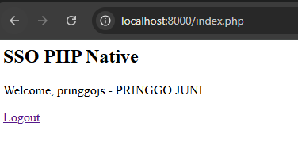

# 🔐 Keycloak SSO Integration with PHP Native

Contoh implementasi **Single Sign-On (SSO)** menggunakan [Keycloak](https://www.keycloak.org/) dan **PHP Native tanpa framework**, dengan protokol **OpenID Connect (OIDC)** dan alur **Authorization Code Flow**.

---

## 📦 Fitur

- 🔐 Login dengan Keycloak menggunakan OIDC
- 📤 Tukar authorization code menjadi access token
- 🙍 Ambil data user (profile, email, username)
- 🚪 Logout dari aplikasi sekaligus dari Keycloak
- 💡 Tanpa framework dan tanpa library tambahan (pure PHP)

---

## 🚀 Cara Menjalankan

### 1. Clone Repository

```bash
git clone https://github.com/pringgojs/php-sso-keycloak.git
cd php-sso-keycloak
```

### 2. Jalankan PHP Built-in Server

```bash
php -S localhost:8000
```

Akses di browser:

```
http://localhost:8000
```

---

## ⚙️ Konfigurasi Keycloak

### 🔧 1. Buat Realm dan Client

- **Realm**: `simashebat` _(atau sesuaikan dengan konfigurasi kamu)_
- **Client ID**: `php-native-app`
- **Client Protocol**: `openid-connect`
- **Access Type**: `confidential`
- **Standard Flow Enabled**: ✅ Yes
- **Valid Redirect URIs**: `http://localhost:8000/callback.php`
- **Post Logout Redirect URIs**: `http://localhost:8000`

> Jangan lupa simpan `Client Secret` dari tab **Credentials**

---

## 📁 Struktur Project

```
php-sso-keycloak/
├── index.php          # Halaman utama
├── login.php          # Redirect ke Keycloak login
├── callback.php       # Tangani response dari Keycloak
├── logout.php         # Logout dari aplikasi dan Keycloak
└── config.php         # Konfigurasi endpoint Keycloak
```

---

## 📝 Konfigurasi Aplikasi (`config.php`)

Edit file `config.php` dengan kredensial dari Keycloak:

```php
<?php
define('KEYCLOAK_BASE_URL', 'YOUR KEYCLOAK BASE URL HERE');
define('KEYCLOAK_REALM', 'YOUR REALM HERE');
define('KEYCLOAK_CLIENT_ID', 'YOUR CLIENT ID HERE');
define('KEYCLOAK_CLIENT_SECRET', 'YOUR SECRET HERE');
define('REDIRECT_URI', 'http://localhost:8000/callback.php');

define('AUTHORIZATION_ENDPOINT', KEYCLOAK_BASE_URL . '/realms/' . KEYCLOAK_REALM . '/protocol/openid-connect/auth');
define('TOKEN_ENDPOINT', KEYCLOAK_BASE_URL . '/realms/' . KEYCLOAK_REALM . '/protocol/openid-connect/token');
define('USERINFO_ENDPOINT', KEYCLOAK_BASE_URL . '/realms/' . KEYCLOAK_REALM . '/protocol/openid-connect/userinfo');
define('LOGOUT_ENDPOINT', KEYCLOAK_BASE_URL . '/realms/' . KEYCLOAK_REALM . '/protocol/openid-connect/logout');
```

---

## 🔄 Alur Login

1. User mengklik "Login with SSO"
2. Dialihkan ke halaman login Keycloak
3. Setelah login, Keycloak redirect ke `callback.php` dengan `code`
4. Aplikasi menukar `code` dengan `access_token` dan `id_token`
5. Aplikasi memanggil endpoint `userinfo` untuk ambil data pengguna
6. Data disimpan di session

---

## 🚪 Alur Logout

1. User mengklik "Logout"
2. Aplikasi menghapus session lokal
3. Redirect ke endpoint logout Keycloak dengan `id_token_hint`
4. Setelah logout, redirect kembali ke aplikasi (`post_logout_redirect_uri`)

---

## 🧪 Contoh Data Userinfo

Contoh hasil response dari Keycloak:

```json
{
  "sub": "abc123",
  "email_verified": true,
  "name": "Pringgo Juni",
  "preferred_username": "pringgojs",
  "given_name": "Pringgo",
  "family_name": "Juni",
  "email": "odyinggo@gmail.com"
}
```

---

## ⚠️ Troubleshooting

| Masalah                               | Penyebab                         | Solusi                                                                  |
| ------------------------------------- | -------------------------------- | ----------------------------------------------------------------------- |
| `Invalid state`                       | Session `oauth2state` hilang     | Pastikan `session_start()` dipanggil dan login dimulai dari `login.php` |
| `invalidParameterMessage` saat logout | `redirect_uri` tidak valid       | Tambahkan URL ke "Valid Redirect URIs" di Keycloak                      |
| Session tidak tersimpan               | Output sebelum `session_start()` | Pindahkan `session_start()` ke baris pertama sebelum HTML               |

---

## 🧰 Tools Tambahan (Opsional)

Jika ingin memperluas:

- [JWT Debugger](https://jwt.io/)
- Gunakan cURL atau Postman untuk menguji endpoint token & userinfo

---

## 📸 Screenshot



---

## 📄 Lisensi

MIT License

---

## 🙋 Kontribusi

Pull request dan issue sangat terbuka!  
Jika kamu ingin menambahkan support framework lain (Laravel, Express, dsb), silakan kontribusi ke repo ini.

---

## ✨ Next Steps

- [ ] Tambahkan versi Laravel (SSO via Socialite)
- [ ] Tambahkan dokumentasi integrasi SPA (Vue/React)
- [ ] Tambahkan testing JWT / PKCE flow

---
